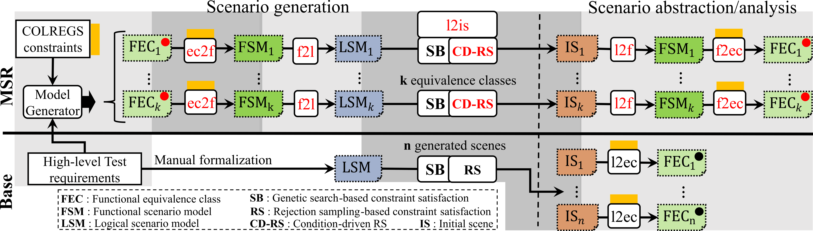

# USVLogicSceneGeneration: Automated Scene Generation for Testing COLREGS-Compliance of Autonomous Surface Vehicles

A Python 3.12 project for generating and evaluating initial scenes for Autonomous Surface Vehicle (ASV) scenario-based testing. This repository includes utilities for risk vector analysis, genetic algorithms and rejection sampling for scene generation and trajectory planning, with detailed visualization and evaluation tools.

This project serves as supplementary material for our research paper **Automated Scene Generation for Testing COLREGS-Compliance of Autonomous Surface Vehicles**.



## Table of Contents
- [Project Structure](#project-structure)
- [Requirements](#requirements)
- [Setup Instructions](#setup-instructions)
- [Usage](#usage)

## Project Structure
The following tree provides an overview of the project structure:

```
├── USVLogicSceneGeneration
│   ├── assets/ # Stores image assets used in
│   │   ├── common_ocean_scenarios/
│   │   │   ├── Florida/
│   │   │   ├── HandcraftedTwoVesselEncounters_01_24/
│   │   │   ├── MiddleEastCoast/
│   │   │   ├── UpperWestCoast/
│   │   ├── figures/
│   │   │   ├── wang2024/
│   │   ├── functional_models/
│   │   │   ├── all/
│   │   │   │   ├── 2vessel_scenarios/
│   │   │   │   ├── 3vessel_scenarios/
│   │   │   │   ├── 4vessel_scenarios/
│   │   │   │   ├── 5vessel_scenarios/
│   │   │   │   ├── 6vessel_scenarios/
│   │   │   ├── ambiguous/
│   │   │   │   ├── 2vessel_scenarios/
│   │   │   │   ├── 3vessel_scenarios/
│   │   │   │   ├── 4vessel_scenarios/
│   │   │   │   ├── 5vessel_scenarios/
│   │   │   │   ├── 6vessel_scenarios/
│   │   ├── gen_data/
│   │   │   ├── parameter_optimization_2/
│   │   │   ├── test_2_vessel_scenarios/
│   │   │   │   ├── SBO/
│   │   │   │   ├── common_ocean_benchmark/
│   │   │   │   ├── scenic_distribution/
│   │   │   ├── test_2_vessel_scenarios_long/
│   │   │   │   ├── SBO/
│   │   │   │   ├── common_ocean_benchmark/
│   │   │   │   ├── scenic_distribution/
│   │   │   ├── test_3_vessel_scenarios/
│   │   │   │   ├── SBO/
│   │   │   │   ├── common_ocean_benchmark/
│   │   │   │   ├── scenic_distribution/
│   │   │   ├── test_3_vessel_scenarios_long/
│   │   │   │   ├── SBO/
│   │   │   │   ├── common_ocean_benchmark/
│   │   │   │   ├── scenic_distribution/
│   │   │   ├── test_4_vessel_scenarios/
│   │   │   │   ├── SBO/
│   │   │   │   ├── common_ocean_benchmark/
│   │   │   │   ├── scenic_distribution/
│   │   │   ├── test_4_vessel_scenarios_long/
│   │   │   │   ├── SBO/
│   │   │   │   ├── common_ocean_benchmark/
│   │   │   │   ├── scenic_distribution/
│   │   │   ├── test_5_vessel_scenarios/
│   │   │   │   ├── SBO/
│   │   │   │   ├── scenic_distribution/
│   │   │   ├── test_5_vessel_scenarios_long/
│   │   │   │   ├── SBO/
│   │   │   │   ├── scenic_distribution/
│   │   │   ├── test_6_vessel_scenarios/
│   │   │   │   ├── SBO/
│   │   │   │   ├── scenic_distribution/
│   │   │   ├── test_6_vessel_scenarios_long/
│   │   │   │   ├── SBO/
│   │   │   │   ├── scenic_distribution/
│   │   ├── images/
│   │   ├── scenic/
│   │   │   ├── 2vessel_scenario.scenic
│   │   │   ├── 3vessel_scenario.scenic
│   │   │   ├── 4vessel_scenario.scenic
│   │   │   ├── 5vessel_scenario.scenic
│   │   │   ├── 6vessel_scenario.scenic
│   │   │   ├── scenic_base.scenic
│   ├── refinery_functional_models/
│   │   ├── COLREGS4_v6.PROBLEM
│   ├── src/ # Source code directory
│   │   ├── commonocean/
│   │   │   ├── common/
│   │   │   │   ├── file_reader.py
│   │   │   │   ├── file_writer.py
│   │   │   │   ├── solution.py
│   │   │   ├── planning/
│   │   │   │   ├── goal.py
│   │   │   │   ├── planning_problem.py
│   │   │   ├── prediction/
│   │   │   │   ├── prediction.py
│   │   │   ├── scenario/
│   │   │   │   ├── obstacle.py
│   │   │   │   ├── scenario.py
│   │   │   │   ├── state.py
│   │   │   │   ├── traffic_sign.py
│   │   │   │   ├── trajectory.py
│   │   │   │   ├── waters.py
│   │   │   ├── visualization/
│   │   │   │   ├── draw_dispatch_cr.py
│   │   │   │   ├── planning.py
│   │   │   │   ├── scenario.py
│   │   │   │   ├── traffic_sign.py
│   │   │   │   ├── util.py
│   │   ├── concrete_level/
│   │   │   ├── models/
│   │   │   │   ├── concrete_scene.py
│   │   │   │   ├── concrete_vessel.py
│   │   │   │   ├── multi_level_scenario.py
│   │   │   │   ├── rrt_models.py
│   │   │   │   ├── trajectories.py
│   │   │   │   ├── trajectory_manager.py
│   │   │   │   ├── vessel_order_graph.py
│   │   │   │   ├── vessel_state.py
│   │   │   ├── trajectory_generation/
│   │   │   │   ├── bidirectional_rrt_star_fnd.py
│   │   │   │   ├── path_interpolator.py
│   │   │   │   ├── scene_builder.py
│   │   │   │   ├── trajectory_builder.py
│   │   │   │   ├── trajectory_data.py
│   │   │   │   ├── trajectory_generator.py
│   │   │   ├── concrete_scene_abstractor.py
│   │   │   ├── data_parser.py
│   │   ├── evaluation/
│   │   │   ├── chi_square_kl_div.py
│   │   │   ├── fishers_exact_odds_ratio.py
│   │   │   ├── mann_whitney_u_cliff_delta.py
│   │   │   ├── permutation_evenness_test.py
│   │   │   ├── risk_evaluation.py
│   │   │   ├── vessel_type_sampler.py
│   │   ├── functional_level/
│   │   │   ├── metamodels/
│   │   │   │   ├── functional_object.py
│   │   │   │   ├── functional_scenario.py
│   │   │   │   ├── interpretation.py
│   │   │   ├── models/
│   │   │   │   ├── functional_model_manager.py
│   │   │   │   ├── model_parser.py
│   │   │   │   ├── object_generator.py
│   │   ├── logical_level/
│   │   │   ├── constraint_satisfaction/
│   │   │   │   ├── evolutionary_computation/
│   │   │   │   │   ├── evolutionary_algorithms/
│   │   │   │   │   │   ├── evolutionary_algorithm_base.py
│   │   │   │   │   │   ├── pygad_ga_algorithm.py
│   │   │   │   │   │   ├── pymoo_nsga2_algorithm.py
│   │   │   │   │   │   ├── pymoo_nsga3_algorithm.py
│   │   │   │   │   │   ├── pymoo_nsga_algorithm.py
│   │   │   │   │   │   ├── pyswarm_pso_algorithm.py
│   │   │   │   │   │   ├── scipy_de_algorithm.py
│   │   │   │   │   ├── aggregates.py
│   │   │   │   │   ├── evaluation_data.py
│   │   │   │   ├── assignments.py
│   │   │   │   ├── evaluation_cache.py
│   │   │   │   ├── scenic_sampling.py
│   │   │   ├── mapping/
│   │   │   │   ├── instance_initializer.py
│   │   │   │   ├── logical_scenario_builder.py
│   │   │   ├── models/
│   │   │   │   ├── actor_variable.py
│   │   │   │   ├── logical_model_manager.py
│   │   │   │   ├── logical_scenario.py
│   │   │   │   ├── penalty.py
│   │   │   │   ├── relation_constraints.py
│   │   │   │   ├── values.py
│   │   │   │   ├── vessel_types.py
│   │   ├── scripts/
│   │   │   ├── annotate_risk_vectors.py
│   │   │   ├── common_ocean_scenario_parser.py
│   │   │   ├── eval_vis.py
│   │   │   ├── evaluation_main.py
│   │   │   ├── generate_project_outline.py
│   │   │   ├── generate_trajectories.py
│   │   │   ├── hyperparam_test.py
│   │   │   ├── scenic_script.py
│   │   │   ├── table_browser.py
│   │   │   ├── test_algorithm.py
│   │   │   ├── trajectory_viewer.py
│   │   │   ├── wang24_eval.py
│   │   ├── utils/
│   │   │   ├── asv_utils.py
│   │   │   ├── file_system_utils.py
│   │   │   ├── math_utils.py
│   │   │   ├── scenario.py
│   │   │   ├── serializable.py
│   │   ├── visualization/
│   │   │   ├── colreg_scenarios/
│   │   │   │   ├── plot_components/
│   │   │   │   │   ├── main_plot_components/
│   │   │   │   │   │   ├── additional_vo_cone_component.py
│   │   │   │   │   │   ├── angle_circle_component.py
│   │   │   │   │   │   ├── centered_angle_circle_component.py
│   │   │   │   │   │   ├── distance_component.py
│   │   │   │   │   │   ├── drawing_component.py
│   │   │   │   │   │   ├── legend_component.py
│   │   │   │   │   │   ├── prime_component.py
│   │   │   │   │   │   ├── ship_image_component.py
│   │   │   │   │   │   ├── ship_markings_component.py
│   │   │   │   │   │   ├── vo_cone_component.py
│   │   │   │   │   ├── metric_components/
│   │   │   │   │   │   ├── proximity_metrics_component.py
│   │   │   │   │   │   ├── risk_metric_component.py
│   │   │   │   │   ├── plot_component.py
│   │   │   │   ├── scenario_animation.py
│   │   │   │   ├── scenario_metrics_plot.py
│   │   │   │   ├── scenario_plot.py
│   │   │   │   ├── scenario_plot_manager.py
│   │   │   ├── evaluation_plots/
│   │   │   │   ├── diversity_plot.py
│   │   │   │   ├── diversity_statistics_table.py
│   │   │   │   ├── eval_plot_manager.py
│   │   │   │   ├── risk_vector_plot.py
│   │   │   │   ├── runtime_plot.py
│   │   │   │   ├── runtime_statistics_table.py
│   │   │   │   ├── scenario_type_statistics_plot.py
│   │   │   │   ├── scenario_type_statistics_table.py
│   │   │   │   ├── success_rate_plot.py
│   │   │   ├── dash_thread.py
│   │   │   ├── plotting_utils.py
│   │   │   ├── trajectory_visualizer.py
```

### Detailed Description
Here the most important components are discussed from the research's perspective.

#### `assets/`
Contains images and plot exports used in the project. Also generated scene and trajectory descriptions are saved here.

- `images/distr.png`: Distribution plot image from https://doi.org/10.1016/j.oceaneng.2023.116436.
- `images/gradient.png`: Gradient scale from https://doi.org/10.1016/j.oceaneng.2023.116436. Used to map values to colors and extract distribution from plot.
- `gen_data/`: All the evaluation data generated to showcase the results of scene generation.
  - `test_X_vessel_scenarios/`: X vessel scenarios generated by SB or Scenic approaches with 4 minutes timeout or extracted from CommonOcean.
  - `test_X_vessel_scenarios_long/`: X vessel scenarios generated by SB or Scenic approaches with 10 minutes timeout or extracted from CommonOcean.
  - `parameter_optimization_2/`: Hyperparameter optimization samples for the search based SB approach
- `figures/`: All the figures used to showcase the results of scene generation.
- `functional_models/`: All possible functional equivalence classes generated by Refinery: https://refinery.services/.
- `common_ocean_scenarios/`: All gathered scenarios from https://commonocean.cps.cit.tum.de/ in the CommonOcean xml format. The scenarios are introduced in the paper [Krasowski2022] H. Krasowski and M. Althoff, “CommonOcean: Composable Benchmarks for Motion Planning on Oceans,” in *Proceedings of the IEEE International Conference on Intelligent Transportation Systems (ITSC)*, 2022.


#### `refinery_functional_models/`
Contains experimental `.problem` files with functional COLREGS scenario specifications in Refinery DSL:  https://refinery.services/.

#### `src/evaluation/`
Modules related to risk and performance evaluation.

- `eqv_class_calculator.py`: Calculates equivalence classes for risk.
- `risk_evaluation.py`: Evaluates risk vectors for OS based on a concrete scene.
- `mann_whitney_u_cliff_delta.py`: Evaluates p-values and effect size for floating point samples.
- `fishers_exact_odds_ratio.py`: Evaluates p-values and effect size for dichotomous samples.
- `chi_square_kl_div.py`: Evaluates Chi-Square p values and KL Divergence effect size.
- `permutation_evenness_test.py`: Evaluates the evenness score of a distribution.

#### `src/commonocean/`
CommonOcean source code for parsing AIS scenarios. The code is taken from the open source repository: https://gitlab.lrz.de/tum-cps/commonocean-io.

#### `src/concrete_level/`
Scenario representation and trajectory synthesis on the concrete level.

- `concrete_scene_abstractor.py`: Abstracts concrete scenes to logical and functional scenarios.
- `data_parser.py`: Parses evaluation data models.
- `trajectory_generation/`: Utils for trajectory generation from concrete scenes using RRT*.
- `models/`: Object model representations for concrete scenes and trajectories.

#### `src/logical_level/`
Scenario representation and scenario synthesis on the logical level.

- `models/`: Object model representations for logical scenarios and variables.
  - `relation_constraints.py`: Defines constraints based on relationship types between vessels.
  - `actor_variable.py`: Data model for representing an actor variable.

- `constraint_satisfaction/`: Object model representations for logical scenarios and variables.
  - `evolutionary_computation/`: Algorithms for optimization and evolutionary computation.
    - `evolutionary_algorithms/`: Implements different optimization algorithms such as NSGAII, NSGAIII, Genetic Algorithm, Swarm Optimization, Differential Evolution.
  - `aggregates.py`: Implements aggregate strategies for calculating fitness functions (Category, Actor, Global aggregates).
  - `evaluation_data.py`: A data model class for storing and loading evaluation results. These files are used to visualize concretization performance and COLREGS scenarios.

- `mapping/`: The mapping of functional models to logical constraints.
  - `logical_scenario_builder.py`: Builds up a logical scenario from a functional one.
  - `instance_initializer.py`: Initializes a population of random or deterministic individuals for evolutionary algorithms.


#### `src/functional_level/`
Abstract metamodel, scenario representation and scenario parsing on the functional level.

- `models/`: Code for parsing functional models from `.problem` files.
- `metamodels/`: Object model representations for functional scenarios and objects.


#### `src/visualizations/`
Utilities for generating visualizations and animations.

- `evaluation_plots/`: Evaluation plots for algorithm performance visualizations (success rate, runtime, risk metrics).
- `colreg_scenarios/`: Visualizations of concrete scenes/scenarios.

#### `src/scripts/`
Tools for conducting the scene generation research in the form of python scripts. See Usage.

#### `src/utils/`
General helper functions and constant definitions. 

- `asv_utils.py`: Maritime domain specific constants and maps to serve as input for the environment definition and scene generation.

## Requirements
The measurements are conducted on an Ubuntu 24.04 machine with an Intel Core Processor (Haswell, model: 60, family: 6) and 32 GB of RAM using Python 3.12.

## Setup Instructions

### 1. Clone the repository

```bash
git clone https://github.com/yourusername/USVLogicSceneGeneration.git
cd USVLogicSceneGeneration
```

### 2. Set Up a Virtual Environment

For isolated project dependencies, it's recommended to use a virtual environment.

```bash
python3.10 -m venv venv
source venv/bin/activate  # On Windows, use `venv\Scripts\activate`
```

### 3. Install Requirements

Once the virtual environment is activated, install the required packages:

```bash
pip install -r requirements.txt
```

## Usage

Instructions on how to run the main scripts, such as evaluation and visualization tools. You can run these scripts directly in your terminal or use the provided configurations in Visual Studio Code for debugging.

### Running from the Terminal

You can execute any of the following Python scripts from the terminal:

```bash
# Generates trajectories by loading an evaluation data file
python src/scripts/trajectory_generator.py

# Loads trajectories that are generated with trajectory_generator.py
python src/scripts/trajectory_viewer.py

# Runs single adhoc tests of scene generation 
python src/scripts/test_algorithm.py

# Runs hyper-parameter tuning for evolutionary algorithms
python src/scripts/hyperparam_test.py

# This is the file with which the evaluation is run for each batch using the SB approach. 
python src/scripts/evaluation_main.py

# Loads folders containing evaluation data and visualizes them in a Dash table on local server. Good for debuging and browsing the data.
python src/scripts/table_browser.py

# Runs the evaluation visualization script where all the plots are generated for the evaluation data used in the research.
python src/scripts/eval_vis.py

# Script for postprocessing evaluation result files for example annotating them with risk vectors.
python src/scripts/annotate_risk_vectors.py

# Script for running scene generation using Scenic3 doi: 10.1145/3314221.3314633
python src/scripts/scenic_script.py

# Extracts the evaluation results from the images images/distr.png and images/gradient.png scraped from https://doi.org/10.1016/j.oceaneng.2023.116436. Used to map values to colors and extract distribution from plot.
python src/scripts/wang24_eval.py

# Parses all the CommonOcean (doi: 10.1109/ITSC55140.2022.9921925) scenarios into our own scene representation
python src/scripts/common_ocean_scenario_parser.py

